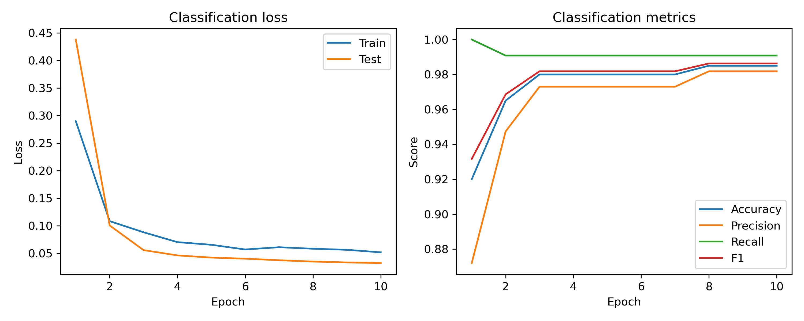
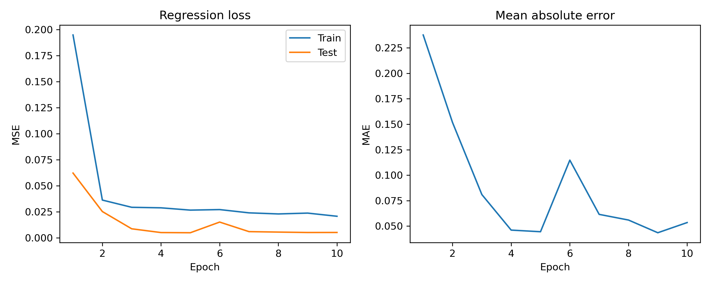
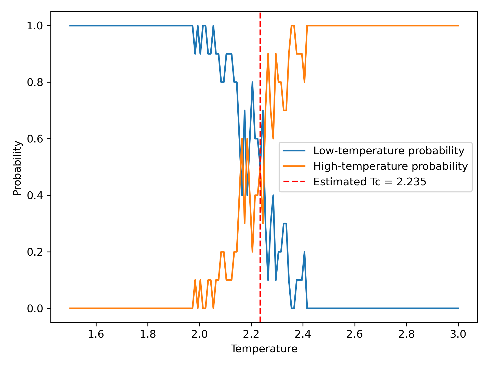
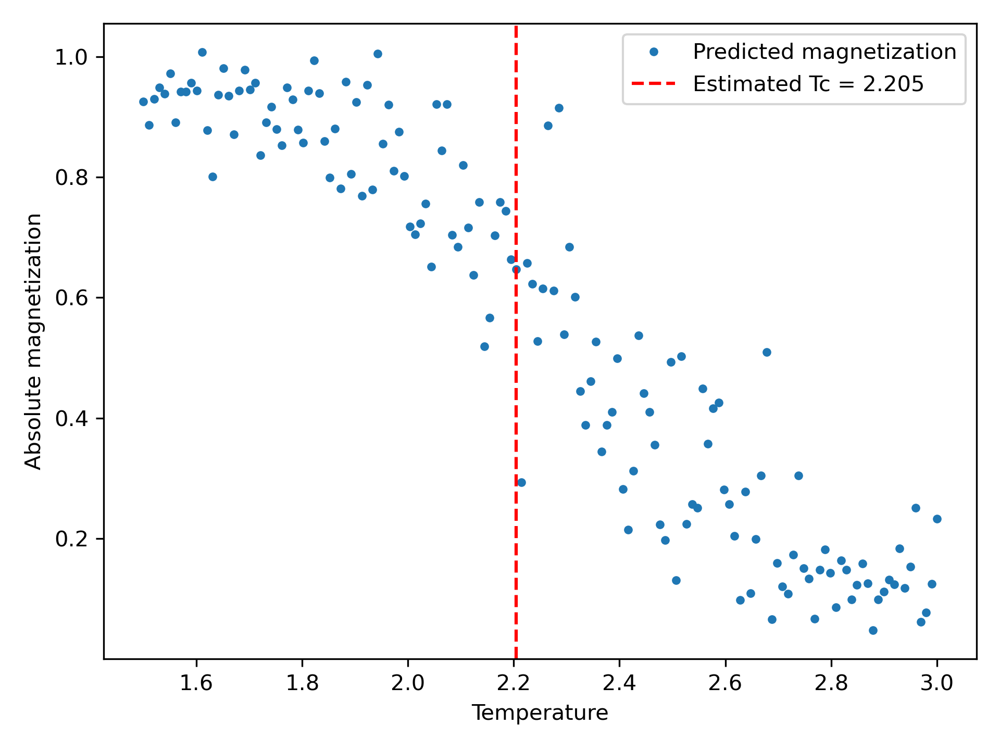
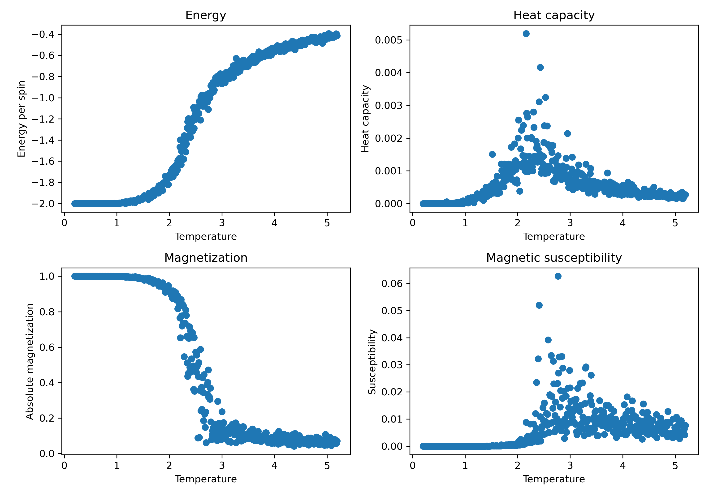

# Ising CNN: Critical-Temperature Prediction with Deep Learning

This project studies the two-dimensional ferromagnetic Ising model with two complementary approaches:

1. **Metropolis Monte Carlo simulation** generates spin configurations and thermodynamic observables.
2. **Convolutional neural networks (CNNs)** learn to classify phases and predict absolute magnetization from those configurations.

The trained CNNs are then used to estimate the critical temperature of the square-lattice Ising model.

## Highlights

- Implements the Metropolis algorithm with periodic boundary conditions.
- Generates paired datasets for phase classification and magnetization regression.
- Trains a shared CNN architecture for two supervised-learning tasks.
- Estimates the critical temperature from the phase-probability crossover and the steepest magnetization decrease.
- Includes generated datasets, trained checkpoints, and result figures in the local project workspace.
- Automatically uses CUDA when it is available, with CPU fallback.

## Physics background

For a square lattice with nearest-neighbor coupling `J = 1`, Boltzmann constant `k_B = 1`, and zero external field, the Hamiltonian is

```math
H = -J \sum_{\langle i,j \rangle} s_i s_j, \qquad s_i \in \{-1, +1\}.
```

The exact critical temperature in these units is

```math
T_c = \frac{2}{\ln(1 + \sqrt{2})} \approx 2.269.
```

## Repository layout

```text
.
|-- ising.py                                           # Metropolis simulation and plotting helpers
|-- data.py                                            # Dataset generation and PyTorch dataset class
|-- ising_cnn.py                                       # Shared CNN, classifier, and regressor definitions
|-- simulation.py                                      # Conventional thermodynamic simulation
|-- ising_classification.py                            # Classification-model training
|-- ising_regression.py                                # Regression-model training
|-- critical_temperature_prediction_by_classification.py
|-- critical_temperature_prediction_regression.py
|-- data/                                              # Generated train/test datasets
|-- models/                                            # Trained PyTorch checkpoints
`-- results/                                           # Saved figures
```

## Environment and installation

The project was developed and verified with the existing Conda environment named `ising`:

- Python 3.10.20
- NumPy 2.2.5
- Matplotlib 3.10.9
- PyTorch 2.13.0 with CUDA 12.6 support

Activate the environment from the project directory:

```bash
conda activate ising
```

For a new environment, create and activate one first:

```bash
conda create -n ising python=3.10
conda activate ising
pip install -r requirements.txt
```

`requirements.txt` specifies the core Python dependencies. Install the PyTorch build appropriate for your OS, Python version, and CUDA driver if you need GPU acceleration. The scripts also run on CPU.

## Included data and checkpoints

The current workspace contains the following generated artifacts:

| Artifact | Location | Size |
| --- | --- | ---: |
| Classification training set | `data/ising_configs_labels_train.pkl` | 1,000 configurations |
| Classification test set | `data/ising_configs_labels_test.pkl` | 200 configurations |
| Regression training set | `data/ising_configs_magnetization_train.pkl` | 1,000 configurations |
| Regression test set | `data/ising_configs_magnetization_test.pkl` | 200 configurations |
| Classification checkpoint | `models/ising_classifier.pth` | -- |
| Regression checkpoint | `models/ising_regressor.pth` | -- |

Each configuration is a `20 x 20` spin lattice. Classification labels are defined as follows:

- `0`: high-temperature (ordered) phase
- `1`: low-temperature (disordered) phase

The regression target is the absolute magnetization averaged over the second half of a Monte Carlo chain.

## Quick start

With the supplied datasets and checkpoints, you can reproduce the predictions directly:

```bash
conda activate ising

python critical_temperature_prediction_by_classification.py
python critical_temperature_prediction_regression.py
```

The scripts load weights from `models/` and save figures under `results/`.

## Reproducing the workflow

### 1. Generate datasets

The following commands create separate training and testing datasets with the paths expected by the training scripts:

```bash
conda activate ising

python -c "from data import generate_datasets; generate_datasets(1000, classification_path='data/ising_configs_labels_train.pkl', regression_path='data/ising_configs_magnetization_train.pkl')"
python -c "from data import generate_datasets; generate_datasets(200, classification_path='data/ising_configs_labels_test.pkl', regression_path='data/ising_configs_magnetization_test.pkl')"
```

Dataset generation is computationally intensive because every configuration is equilibrated with 25,000 Metropolis steps.

### 2. Train the CNNs

```bash
python ising_classification.py
python ising_regression.py
```

The default setup trains for 10 epochs with a batch size of 64 and SGD learning rate of 0.01. Checkpoints are written to `models/` and learning curves to `results/`.

### 3. Estimate the critical temperature

```bash
python critical_temperature_prediction_by_classification.py
python critical_temperature_prediction_regression.py
```

- The classifier estimates `T_c` where the low- and high-temperature phase probabilities cross.
- The regressor estimates `T_c` at the most negative gradient of predicted magnetization with respect to temperature.

### 4. Run the Monte Carlo baseline

```bash
python simulation.py
```

This script produces spin configurations at representative temperatures and a four-panel plot of energy, heat capacity, magnetization, and magnetic susceptibility.

## Model architecture

Both learning tasks use the same CNN backbone:

```text
Input: 1 x 20 x 20 spin configuration
Conv2d(1, 16) -> BatchNorm -> ReLU
Conv2d(16, 32) -> BatchNorm -> ReLU -> MaxPool2d
Conv2d(32, 64) -> BatchNorm -> ReLU -> MaxPool2d
Flatten -> Linear(1600, 128) -> ReLU -> Dropout(0.5)
Output: 2 logits (classification) or 1 value (regression)
```

The architecture is defined for `20 x 20` lattices. If you change the lattice size, update the first linear layer in `ising_cnn.py` accordingly.

## Results

### CNN training

Classification training tracks loss, accuracy, precision, recall, and F1 score.



Regression training tracks mean-squared error and mean absolute error.



### Critical-temperature prediction

The classification model identifies the transition from the phase-probability crossover:



The regression model identifies the transition from the sharpest decrease in predicted magnetization:



### Monte Carlo observables

The conventional simulation reproduces temperature-dependent energy, heat capacity, magnetization, and susceptibility:



## Reproducibility notes

- Monte Carlo sampling and neural-network optimization are stochastic, so numerical results may vary between runs.
- The simulation uses periodic boundary conditions and initializes each chain with aligned spins.
- The code uses `torch.cuda.is_available()` to select a CUDA device when possible; no code changes are needed for CPU execution.

